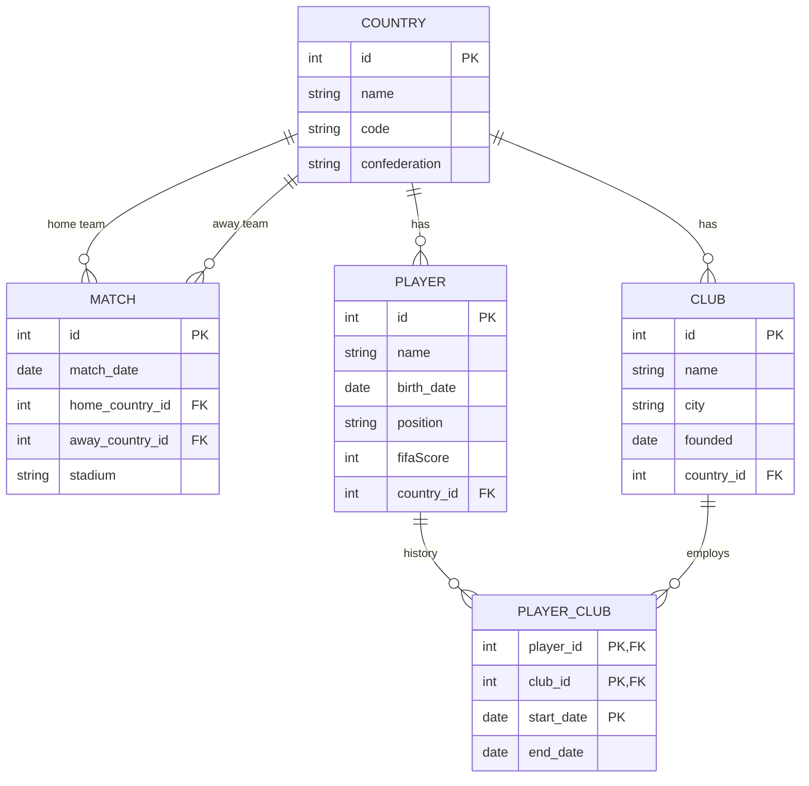

Modelo corregido según el diagrama del parcial. PLAYER_CLUB se identifica con jugador + club + fecha de inicio; no tiene un id numérico independiente. MATCH se mapea en Java a la tabla match_game.

